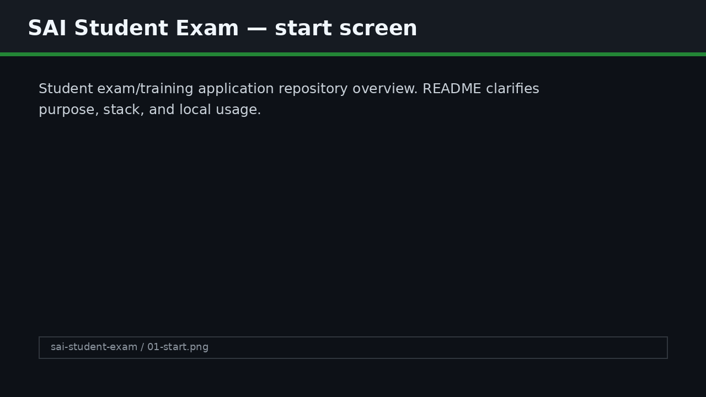
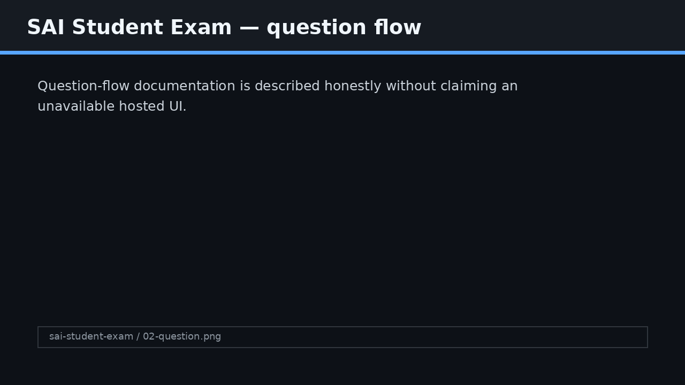
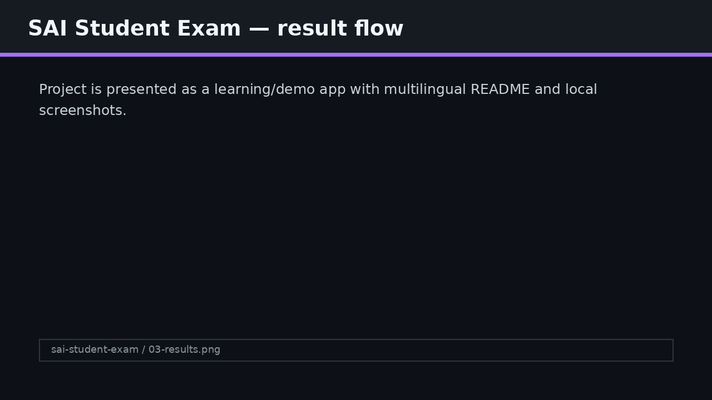

# SAI Student Exam

## English
A browser-based student exam/quiz application.

### Features
- Student information form.
- Client-side quiz flow.
- Question data separated into JavaScript.

### Screenshots

### Run locally
Use any static file server and open the project in a browser. Example: Python built-in HTTP server on port 8000.

## Русский
Браузерное приложение для экзамена/теста студентов.

### Возможности
- Student information form.
- Client-side quiz flow.
- Question data separated into JavaScript.

### Скриншоты

### Локальный запуск
Запусти любой статический HTTP-сервер и открой проект в браузере. Например, встроенный Python HTTP server на порту 8000.

## Українська
Браузерний застосунок для іспиту/тесту студентів.

### Можливості
- Student information form.
- Client-side quiz flow.
- Question data separated into JavaScript.

### Скріншоти

### Локальний запуск
Запусти будь-який статичний HTTP-сервер і відкрий проєкт у браузері. Наприклад, вбудований Python HTTP server на порту 8000.
